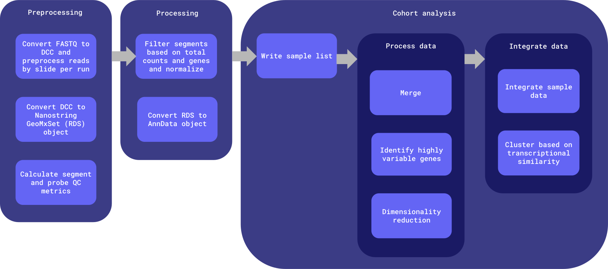
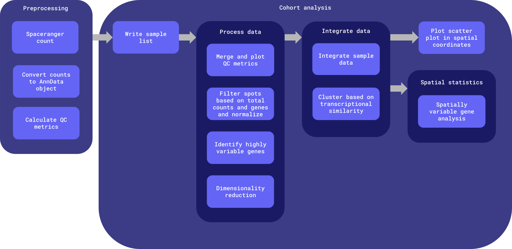

# pmdbs-spatial-transcriptomics-wf
Repo for testing and developing a common postmortem-derived brain sequencing (PMDBS) workflow harmonized across ASAP with human and mouse spatial transcriptomics data for both Nanostring GeoMx and 10x Visium platforms.

Common workflows, tasks, utility scripts, and docker images reused across harmonized ASAP workflows are defined in [the wf-common repository](wf-common).


# Table of contents

- [Workflows](#workflows)
- [Inputs](#inputs)
- [Outputs](#outputs)
	- [Output structure](#output-structure)
- [Docker images](#docker-images)


# Workflows

Worfklows are defined in [the `workflows` directory](workflows). There is [the `pmdbs_spatial_geomx` workflow directory](workflows/pmdbs_spatial_geomx) and [the `pmdbs_spatial_visium` workflow directory](workflows/pmdbs_spatial_visium).

These workflows are set up to analyze spatial transcriptomics data: Nanostring GeoMx and 10x Visium in WDL using mainly command line and a Python script.

**Nanostring GeoMx workflow diagram:**


**Nanostring GeoMx entrypoint**: [workflows/pmdbs_spatial_geomx/main.wdl](workflows/pmdbs_spatial_geomx/main.wdl)

**Nanostring GeoMx input template**: [workflows/pmdbs_spatial_geomx/inputs.json](workflows/pmdbs_spatial_geomx/inputs.json)

**10x Visium workflow diagram:**


**10x Visium entrypoint**: [workflows/pmdbs_spatial_visium/main.wdl](workflows/pmdbs_spatial_visium/main.wdl)

**10x Visium input template**: [workflows/pmdbs_spatial_visium/inputs.json](workflows/pmdbs_spatial_visium/inputs.json)

Both workflows follow a similar structure, it is broken up into two main chunks:

1. [Preprocessing](#preprocessing)
2. [Cohort analysis](#cohort-analysis)

The 10x Visium workflow has a step in between for [image analysis](#image-analysis).

## Preprocessing

Run once per sample; only rerun when the preprocessing workflow version is updated. Preprocessing outputs are stored in the originating team's raw and staging data buckets.

## Image analysis (10x Visium only)

Run once per sample; only rerun when the image analysis workflow version is updated. Image analysis outputs are not saved, but instead, treated as intermediate outputs.

## Cohort analysis

Run once per team (all samples from a single team) if `project.run_project_cohort_analysis` is set to `true`, and once for the whole cohort (all samples from all teams) if `run_cross_team_cohort_analysis` is set to `true`. This can be rerun using different sample subsets; including additional samples requires this entire analysis to be rerun. Intermediate files from previous runs are not reused and are stored in timestamped directories.


# Inputs

## Nanostring GeoMx inputs

An input template file can be found at [workflows/pmdbs_spatial_geomx/inputs.json](workflows/pmdbs_spatial_geomx/inputs.json).

| Type | Name | Description |
| :- | :- | :- |
| String | cohort_id | Name of the cohort; used to name output files during cross-team cohort analysis. |
| Array[[Project](#project)] | projects | The project ID, set of samples and their associated reads and metadata, output bucket locations, and whether or not to run project-level cohort analysis. |
| File | config_ini | The configuration (.ini) file, containing pipeline processing parameters. |
| File | geomxngs_config_pkc | The GeoMx DSP configuration file to associate assay targets with GeoMx HybCode barcodes and Seq Code primers; see https://nanostring.com/products/geomx-digital-spatial-profiler/geomx-dsp-configuration-files/. |
| Int? | filter_cells_min_counts | Minimum number of counts required for a cell to pass filtering. [5000] |
| Int? | filter_genes_min_cells | Minimum number of cells expressed required for a gene to pass filtering. [10] |
| Boolean? | run_cross_team_cohort_analysis | Whether to run downstream harmonization steps on all samples across projects. If set to false, only preprocessing steps (GeoMxNGSPipeline and generating the initial adata object(s)) will run for samples. [false] |
| String | cohort_raw_data_bucket | Bucket to upload cross-team cohort analysis intermediate files to. |
| Array[String] | cohort_staging_data_buckets | Buckets to upload cross-team cohort analysis outputs to. |
| String | container_registry | Container registry where workflow Docker images are hosted. |
| String? | zones | Space-delimited set of GCP zones where compute will take place. ['us-central1-c us-central1-f'] |

## 10x Visium inputs

An input template file can be found at [workflows/pmdbs_spatial_visium/inputs.json](workflows/pmdbs_spatial_visium/inputs.json).

| Type | Name | Description |
| :- | :- | :- |
| String | cohort_id | Name of the cohort; used to name output files during cross-team cohort analysis. |
| Array[[Project](#project)] | projects | The project ID, set of samples and their associated reads and metadata, output bucket locations, and whether or not to run project-level cohort analysis. |
| File | spaceranger_reference_data | Space Ranger transcriptome reference data; see https://www.10xgenomics.com/support/software/space-ranger/downloads and [10x Visium notes](#10x-visium-notes). |
| File | visium_probe_set_csv | Visium probe-based assays target genes in Space Ranger transcriptome; see https://www.10xgenomics.com/support/software/space-ranger/downloads and [10x Visium notes](#10x-visium-notes). |
| Int? | filter_cells_min_counts | Minimum number of counts required for a cell to pass filtering. [5000] |
| Int? | filter_cells_min_genes | Minimum number of genes required for a cell to pass filtering. [3000] |
| Int? | filter_genes_min_cells | Minimum number of cells expressed required for a gene to pass filtering. [10] |
| Float? | filter_mt_max_percent | Maximum percentage of mitochondrial read counts for a cell to pass filtering. [0.2] |
| Float? | normalize_target_sum | The total count to which each cell's gene expression values will be normalized. [1e4] |
| Int? | n_top_genes | Number of highly-variable genes to keep. [3000] |
| Int? | n_comps | Number of principal components to compute. [30] |
| String? | batch_key | Key in AnnData object for batch information. ['batch_id'] |
| Float? | leiden_resolution | Value controlling the coarseness of the Leiden clustering. [0.4] |
| Boolean? | run_cross_team_cohort_analysis | Whether to run downstream harmonization steps on all samples across projects. If set to false, only preprocessing steps ( and generating the initial adata object(s)) will run for samples. [false] |
| String | cohort_raw_data_bucket | Bucket to upload cross-team cohort analysis intermediate files to. |
| Array[String] | cohort_staging_data_buckets | Buckets to upload cross-team cohort analysis outputs to. |
| String | container_registry | Container registry where workflow Docker images are hosted. |
| String? | zones | Space-delimited set of GCP zones where compute will take place. ['us-central1-c us-central1-f'] |

## Structs

### Project

| Type | Name | Description |
| :- | :- | :- |
| String | team_id | Unique identifier for team; used for naming output files. |
| String | dataset_id | Unique identifier for dataset; used for naming output files. |
| Array[[Sample](#sample)] | samples | The set of samples associated with this project. |
| File? | project_sample_metadata_csv | CSV containing all sample information including batch, condition, etc. This is required for the bulk RNAseq pipeline. For the `batch` column, there must be at least two distinct values. |
| File? | project_condition_metadata_csv | CSV containing condition and intervention IDs used to categorize conditions into broader groups for DESeq2 pairwise condition ('Case', 'Control', and 'Other'). This is required for the bulk RNAseq pipeline. |
| Boolean | run_project_cohort_analysis | Whether or not to run cohort analysis within the project. |
| String | raw_data_bucket | Raw data bucket; intermediate output files that are not final workflow outputs are stored here. |
| String | staging_data_bucket | Staging data bucket; final project-level outputs are stored here. |

### Sample

| Type | Name | Description |
| :- | :- | :- |
| String | sample_id | Unique identifier for the sample within the project. |
| String? | batch | The sample's batch. |
| File | fastq_R1 | Path to the sample's read 1 FASTQ file. |
| File | fastq_R2 | Path to the sample's read 2 FASTQ file. |
| File? | fastq_I1 | Optional fastq index 1. |
| File? | fastq_I2 | Optional fastq index 2. |
| File? | visium_brightfield_image | Optional 10x Visium brightfield image. This is required for the spatial transcriptomics 10x Visium pipeline. |

## Generating the inputs JSON

The inputs JSON may be generated manually, however when running a large number of samples, this can become unwieldly. The `generate_inputs` utility script may be used to automatically generate the inputs JSON. The script requires the libraries outlined in [the requirements.txt file](wf-common/util/requirements.txt) and the following inputs:

- `project-tsv`: One or more project TSVs with one row per sample and columns team_id, sample_id, batch, fastq_path. All samples from all projects may be included in the same project TSV, or multiple project TSVs may be provided.
	- `team_id`: A unique identifier for the team from which the sample(s) arose
	- `dataset_id`: A unique identifier for the dataset from which the sample(s) arose
	- `sample_id`: A unique identifier for the sample within the project
	- `batch`: The sample's batch
	- `fastq_path`: The directory in which paired sample FASTQs may be found, including the gs:// bucket name and path
		- This is appended to the `project-tsv` from the `fastq-locs-txt`: FASTQ locations for all samples provided in the `project-tsv`, one per line. Each sample is expected to have one set of paired fastqs located at `${fastq_path}/${sample_id}*`. The read 1 file should include 'R1' somewhere in the filename; the read 2 file should inclue 'R2' somewhere in the filename. Generate this file e.g. by running `gsutil ls gs://fastq_bucket/some/path/**.fastq.gz >> fastq_locs.txt`
- `inputs-template`: The inputs template JSON file into which the `projects` information derived from the `project-tsv` will be inserted. Must have a key ending in `*.projects`. Other default values filled out in the inputs template will be written to the output inputs.json file.
- `run-project-cohort-analysis`: Optionally run project-level cohort analysis for provided projects. This value will apply to all projects. [false]
- `workflow_name`: WDL workflow name.
- `cohort-dataset`: Dataset name in cohort bucket name (e.g. 'sc-rnaseq').
- `output-file-prefix`: Optional output file prefix name. [inputs.{cohort_staging_bucket_type}.{source}-{cohort_dataset}.{date}.json]

Example usage:

```bash
./wf-common/util/generate_inputs \
	--project-tsv metadata.tsv \
	--inputs-template workflows/inputs.json \
	--run-project-cohort-analysis \
	--workflow-name pmdbs_spatial_geomx_analysis \
	--cohort-dataset spatial-geomx \
	--output-file inputs.harmonized_spatial_geomx_workflow.json

./wf-common/util/generate_inputs \
	--project-tsv metadata.tsv \
	--inputs-template workflows/inputs.json \
	--run-project-cohort-analysis \
	--workflow-name pmdbs_spatial_visium_analysis \
	--cohort-dataset spatial-visium \
	--output-file inputs.harmonized_spatial_visium_workflow.json
```

# Outputs

## Output structure

- `cohort_id`: either the `team_id` for project-level downstream analysis, or the `cohort_id` for the full cohort
- `workflow_run_timestamp`: format: `%Y-%m-%dT%H-%M-%SZ`
- The list of samples used to generate the cohort analysis will be output alongside other cohort analysis outputs in the staging data bucket (`${cohort_id}.sample_list.tsv`)
- The MANIFEST.tsv file in the staging data bucket describes the file name, md5 hash, timestamp, workflow version, workflow name, and workflow release for the run used to generate each file in that directory

### Raw data (intermediate files and final outputs for all runs of the workflow)

The raw data bucket will contain *some* artifacts generated as part of workflow execution. Following successful workflow execution, the artifacts will also be copied into the staging bucket as final outputs.

In the workflow, task outputs are either specified as `String` (final outputs, which will be copied in order to live in raw data buckets and staging buckets) or `File` (intermediate outputs that are periodically cleaned up, which will live in the cromwell-output bucket). This was implemented to reduce storage costs.

```bash
asap-raw-{cohort,team-xxyy}-{source}-{dataset}
└── workflow_execution
    └── pmdbs_spatial_geomx
        ├── cohort_analysis
        │   └──${cohort_analysis_workflow_version}
        │      └── ${workflow_run_timestamp}
        │          └── <cohort_analysis outputs>
        └── preprocess
            ├── fastq_to_dcc
            │   └── ${fastq_to_dcc_task_version}
            │       └── <fastq_to_dcc output>
            ├── dcc_to_adata
            │   └── ${dcc_to_adata_task_version}
            │       └── <dcc_to_adata output>
            └── qc
                └── ${qc_task_version}
                    └── <qc output>

asap-raw-{cohort,team-xxyy}-{source}-{dataset}
└── workflow_execution
    └── pmdbs_spatial_visium
        ├── cohort_analysis
        │   └──${cohort_analysis_workflow_version}
        │      └── ${workflow_run_timestamp}
        │          └── <cohort_analysis outputs>
        ├── image_analysis
        │   └── image_features
        │       └── ${image_features_task_version}
        │           └── <image_features outputs>
        └── preprocess
            ├── spaceranger_count
            │   └── ${spaceranger_count_task_version}
            │       └── <spaceranger_count output>
            ├── counts_to_adata
            │   └── ${counts_to_adata_task_version}
            │       └── <counts_to_adata output>
            └── qc
                └── ${qc_task_version}
                    └── <qc output>
```

### Staging data (intermediate workflow objects and final workflow outputs for the latest run of the workflow)

Following QC by researchers, the objects in the dev or uat bucket are synced into the curated data buckets, maintaining the same file structure. Curated data buckets are named `asap-curated-{cohort,team-xxyy}-{source}-{dataset}`.

Data may be synced using [the `promote_staging_data` script](#promoting-staging-data).

```bash
asap-dev-{cohort,team-xxyy}-{source}-{dataset}
└── pmdbs_spatial_geomx
    ├── cohort_analysis
    │   ├── ${cohort_id}.sample_list.tsv
    │   ├──	${cohort_id}.merged_adata_object.h5ad
    │   ├── ${cohort_id}.qc_hist.png
    │   ├── ${cohort_id}.umap_cluster.png
    │   ├── ${cohort_id}.moran_top_10_variable_genes.csv
    │   ├── ${cohort_id}.nhood_enrichment.png
    │   ├── ${cohort_id}.final_adata_object.h5ad
    │   ├── ${cohort_id}.co_occurrence.png
    │   └── MANIFEST.tsv
    └── preprocess
        ├── ${sampleA_id}.DCC.zip
        ├── ${sampleA_id}.geomxngs_out_dir.tar.gz
        ├── ${sampleA_id}.initial_adata_object.h5ad
        ├── ${sampleA_id}.qc.h5ad
        ├── MANIFEST.tsv
        ├── ...
        ├── ${sampleN_id}.DCC.zip
        ├── ${sampleN_id}.geomxngs_out_dir.tar.gz
        ├── ${sampleN_id}.initial_adata_object.h5ad
        ├── ${sampleN_id}.qc.h5ad
        └── MANIFEST.tsv

asap-dev-{cohort,team-xxyy}-{source}-{dataset}
└── pmdbs_spatial_visium
    ├── cohort_analysis
    │   ├── ${cohort_id}.sample_list.tsv
    │   ├──	${cohort_id}.merged_adata_object.h5ad
    │   ├── ${cohort_id}.qc_violin.png
    │   ├── ${cohort_id}.qc_dist.png
    │   ├── ${cohort_id}.hvg_dispersion.png
    │   ├── ${cohort_id}.umap_cluster.png
    │   ├── ${cohort_id}.image_features_spatial_scatter.png
    │   ├── ${cohort_id}.final_adata_object.h5ad
    │   ├── ${cohort_id}.moran_top_10_variable_genes.csv
    │   ├── ${cohort_id}.moran_top_3_variable_genes_spatial_scatter.png
    │   └── MANIFEST.tsv
    └── preprocess
        ├── ${sampleA_id}.raw_feature_bc_matrix.h5
        ├── ${sampleA_id}.filtered_feature_bc_matrix.h5
        ├── ${sampleA_id}.initial_adata_object.h5ad
        ├── ${sampleA_id}.molecule_info.h5
        ├── ${sampleA_id}.metrics_summary.csv
        ├── ${sampleA_id}.spaceranger_spatial_outputs.tar.gz
        ├── ${sampleA_id}.aligned_fiducials.jpg
        ├── ${sampleA_id}.detected_tissue_image.jpg
        ├── ${sampleA_id}.tissue_hires_image.png
        ├── ${sampleA_id}.tissue_lowres_image.png
        ├── ${sampleA_id}.scalefactors_json.json
        ├── ${sampleA_id}.tissue_positions.csv
        ├── ${sampleA_id}.spatial_enrichment.csv
        ├── ${sampleA_id}.initial_adata_object.h5ad
        ├── ${sampleA_id}.qc.h5ad
        ├── MANIFEST.tsv
        ├── ...
        ├── ${sampleN_id}.raw_feature_bc_matrix.h5
        ├── ${sampleN_id}.filtered_feature_bc_matrix.h5
        ├── ${sampleN_id}.initial_adata_object.h5ad
        ├── ${sampleN_id}.molecule_info.h5
        ├── ${sampleN_id}.metrics_summary.csv
        ├── ${sampleN_id}.spaceranger_spatial_outputs.tar.gz
        ├── ${sampleN_id}.aligned_fiducials.jpg
        ├── ${sampleN_id}.detected_tissue_image.jpg
        ├── ${sampleN_id}.tissue_hires_image.png
        ├── ${sampleN_id}.tissue_lowres_image.png
        ├── ${sampleN_id}.scalefactors_json.json
        ├── ${sampleN_id}.tissue_positions.csv
        ├── ${sampleN_id}.spatial_enrichment.csv
        ├── ${sampleN_id}.initial_adata_object.h5ad
        ├── ${sampleN_id}.qc.h5ad
        └── MANIFEST.tsv
```

## Promoting staging data

The [`promote_staging_data` script](wf-common/util/promote_staging_data) can be used to promote staging data that has been approved to the curated data bucket for a team or set of teams.

This script compiles bucket and file information for both the initial (staging) and target (prod) environment. It also runs data integrity tests to ensure staging data can be promoted and generates a Markdown report. It (1) checks that files are not empty and are not less than or equal to 10 bytes (factoring in white space) and (2) checks that files have associated metadata and is present in MANIFEST.tsv.

If data integrity tests pass, this script will upload a combined MANIFEST.tsv and the data promotion Markdown report under a metadata/{timestamp} directory in the staging bucket. Previous manifest files and reports will be kept. Next, it will rsync all files in the staging bucket to the curated bucket's upstream, downstream, cohort_analysis, and metadata directories. **Exercise caution when using this script**; files that are not present in the source (staging) bucket will be deleted at the destination (curated) bucket.

If data integrity tests fail, staging data cannot be promoted. The combined MANFIEST.tsv, Markdown report, and promote_staging_data_script.log will be locally available.

The script defaults to a dry run, printing out the files that would be copied or deleted for each selected team.

### Options

```
-h  Display this message and exit
-t  Space-delimited team(s) to promote data for
-l  List available teams
-s  Source name in bucket name
-d  Space-delimited dataset name(s) in team bucket name, must follow the same order as {team}
-w  Workflow name used as a directory in bucket
-p  Promote data. If this option is not selected, data that would be copied or deleted is printed out, but files are not actually changed (dry run)
-e  Staging bucket type; options are 'uat' or 'dev' ['uat']
```

### Usage

```bash
# List available teams
./wf-common/util/promote_staging_data -t cohort -l -s pmdbs -d spatial-geomx -w pmdbs_spatial_geomx
./wf-common/util/promote_staging_data -t cohort -l -s pmdbs -d spatial-visium -w pmdbs_spatial_visium

# Print out the files that would be copied or deleted from the staging bucket to the curated bucket for teams team-hardy and team-biederer
./wf-common/util/promote_staging_data -t team-hardy team-biederer -s pmdbs -d spatial-geomx -w pmdbs_spatial_geomx

# Promote data for team-hardy and cohort
./wf-common/util/promote_staging_data -t team-hardy cohort -s pmdbs -d spatial-geomx -w pmdbs_spatial_geomx -p -e dev
```

# Docker images

Docker images are defined in [the `docker` directory](docker). Each image must minimally define a `build.env` file and a `Dockerfile`.

Example directory structure:
```bash
docker
├── geomxngs
│   ├── build.env
│   └── Dockerfile
└── spatial_py
    ├── build.env
    ├── Dockerfile
    ├── requirements.txt
    └── scripts
        ├── counts_to_adata.py
        ├── visium_qc.py
        ├── image_features.py
        ├── merge_and_plot_visium_qc.py
        ├── filter_and_normalize.py
        ├── dim_reduction_and_clustering.py
        ├── plot_spatial.py
        ├── identify_spatially_variable_genes.py
        └── ...
```

## The `build.env` file

Each target image is defined using the `build.env` file, which is used to specify the name and version tag for the corresponding Docker image. It must contain at minimum the following variables:

- `IMAGE_NAME`
- `IMAGE_TAG`

All variables defined in the `build.env` file will be made available as build arguments during Docker image build.

The `DOCKERFILE` variable may be used to specify the path to a Dockerfile if that file is not found alongside the `build.env` file, for example when multiple images use the same base Dockerfile definition.

## Building Docker images

Docker images can be build using the [`build_docker_images`](https://github.com/DNAstack/bioinformatics-scripts/blob/main/scripts/build_docker_images) script.

```bash
# Build a single image
./build_docker_images -d docker/geomxngs

# Build all images in the `docker` directory
./build_docker_images -d docker

# Build and push all images in the docker directory, using the `dnastack` container registry
./build_docker_images -d docker -c dnastack -p
```

## Tool and library versions

| Image | Major tool versions | Links | Workflow |
| :- | :- | :- | :- |
| geomxngs | <ul><li>[geomxngs v3.1.1.6](https://nanostring.app.box.com/v/GeoMxSW3-1-0/folder/233772026049)</li></ul> | [Dockerfile](https://github.com/ASAP-CRN/pmdbs-spatial-transcriptomics-wf/tree/main/docker/geomxngs) | pmdbs_spatial_geomx |
| spatial_py | Python (v3.12.5) libraries: <ul><li>[squidpy v1.6.2](https://github.com/scverse/squidpy/releases/tag/v1.6.2)</li><li>[matplotlib v3.10.0](https://github.com/matplotlib/matplotlib/releases/tag/v3.10.0)</li><li>[seaborn v0.13.2](https://github.com/mwaskom/seaborn/releases/tag/v0.13.2)</li><li>[scanpy v1.10.4](https://github.com/scverse/scanpy/releases/tag/1.10.4)</li><li>[stlearn v0.4.10](https://github.com/BiomedicalMachineLearning/stLearn/releases/tag/0.4.10)</li></ul> | [Dockerfile](https://github.com/ASAP-CRN/pmdbs-spatial-transcriptomics-wf/tree/main/docker/spatial_py) | both |
| spaceranger | <ul><li>[spaceranger v3.1.2](https://www.10xgenomics.com/support/software/space-ranger/latest/release-notes/release-notes-for-SR#v-3-1-2)</li></ul> | [Dockerfile](https://github.com/ASAP-CRN/pmdbs-spatial-transcriptomics-wf/tree/main/docker/spaceranger) | pmdbs_spatial_visium |
| util | <ul><li>[google-cloud-cli 444.0.0-slim](https://cloud.google.com/sdk/docs/release-notes#44400_2023-08-22)</li></ul> | [Dockerfile](https://github.com/ASAP-CRN/wf-common/tree/main/docker/util) | both |


# wdl-ci

[`wdl-ci`](https://github.com/DNAstack/wdl-ci) provides tools to validate and test workflows and tasks written in [Workflow Description Language (WDL)](https://github.com/openwdl/wdl). In addition to the tests packaged in `wdl-ci`, the [pmdbs-wdl-ci-custom-test-dir](./pmdbs-spatial-wdl-ci-custom-test-dir) is a directory containing custom WDL-based tests that are used to test workflow tasks. `wdl-ci` in this repository is set up to run on pull request.

In general, `wdl-ci` will use inputs provided in the [wdl-ci.config.json](./wdl-ci.config.json) and compare current outputs and validated outputs based on changed tasks/workflows to ensure outputs are still valid by meeting the critera in the specified tests. For example, if the DCC to adata task in our workflow was changed, then this task would be submitted and that output would be considered the "current output". When inspecting the initial adata object, there is a test specified in the [wdl-ci.config.json](./wdl-ci.config.json) called, "check_hdf5". The test will compare the "current output" and "validated output" (provided in the [wdl-ci.config.json](./wdl-ci.config.json)) to make sure that the .h5ad file is still a valid HDF5 file.


# Notes

## Nanostring GeoMx notes
The Nanostring GeoMx configuration (.pkc) files were obtained from https://nanostring.com/products/geomx-digital-spatial-profiler/geomx-dsp-configuration-files/.
- [Human_WTA_v1.0](https://nanostring.com/wp-content/uploads/Hs_R_NGS_WTA_v1.0.pkc_.zip) for Human Whole Transcriptome Atlas
- [Mouse_WTA_v2.0](https://nanostring.com/wp-content/uploads/2024/06/Mm_R_NGS_WTA_v2.0.zip) for Mouse Whole Transcriptome Atlas

## 10x Visium notes

The Space Ranger reference data were obtained from https://www.10xgenomics.com/support/software/space-ranger/downloads.
- [Human reference (GRCh38)](https://cf.10xgenomics.com/supp/spatial-exp/refdata-gex-GRCh38-2020-A.tar.gz)
- [Mouse reference (mm10)](https://cf.10xgenomics.com/supp/spatial-exp/refdata-gex-mm10-2020-A.tar.gz)

The Space Ranger probe set data were obtained from https://www.10xgenomics.com/support/software/space-ranger/downloads.
- [Human Transcriptome v2](https://cf.10xgenomics.com/supp/spatial-exp/probeset/Visium_Human_Transcriptome_Probe_Set_v2.0_GRCh38-2020-A.csv)
- [Mouse Transcriptome v2](https://cf.10xgenomics.com/supp/spatial-exp/probeset/Visium_Mouse_Transcriptome_Probe_Set_v2.0_mm10-2020-A.csv)
